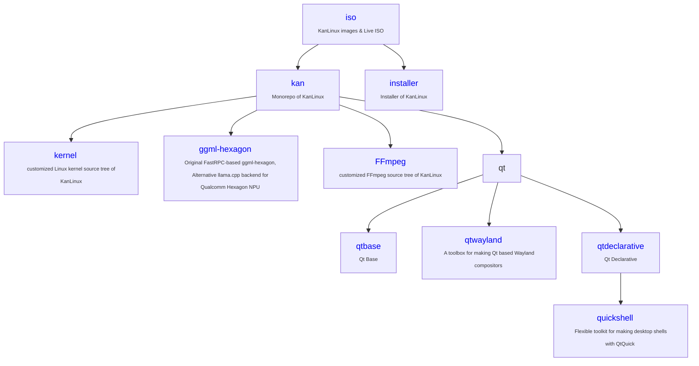

## Overview

The kan-linux on Github develops and supports the kan-linux and related projects.

- [https://huggingface.co/kan-linux](https://huggingface.co/kan-linux)  - kan-linux at Hugging Face

- [https://kan-linux.com](https://kan-linux.com) - kan-linux 's official website

  

