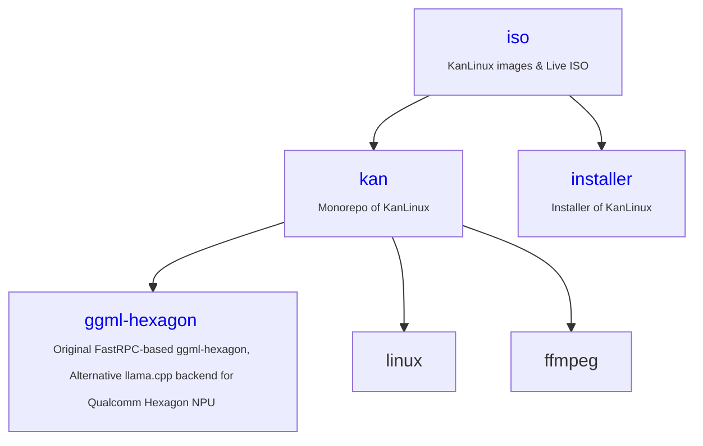

## Overview

The kan-linux on Github develops and supports the kan-linux and related projects.

- [https://huggingface.co/kan-linux](https://huggingface.co/kan-linux)  - kan-linux at Hugging Face

- [kan](https://github.com/kan-linux/kan): an Agent-First, Agent-Friendly modern Linux desktop built from scratch

- [ggml-hexagon](https://github.com/kan-linux/ggml-hexagon/discussions/84): Original FastRPC-based ggml-hexagon, Alternative llama.cpp backend for Qualcomm Hexagon NPU (Android / WoS(Windows on Snapdragon) / Linux)
  

